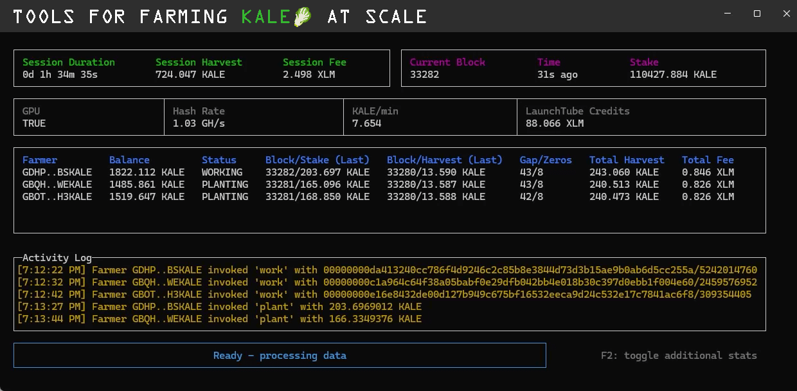

[](https://github.com/FredericRezeau/kale-miner/actions/workflows/build.yml)
[](/LICENSE)

# kale-miner



> **In a rush?** Watch this [Youtube Video Tutorial](https://www.youtube.com/watch?v=yaiEX62P4BA) to compile and run the C++ CPU/GPU Miner, and start farming KALE in less than 10 minutes!

## CPU/GPU Miner for KALE

`kale-miner` is a CPU/GPU miner written in C++ for [KALE](https://stellar.expert/explorer/public/contract/CB23WRDQWGSP6YPMY4UV5C4OW5CBTXKYN3XEATG7KJEZCXMJBYEHOUOV) on the [Stellar](https://stellar.org/) blockchain. It supports **CPU parallel processing**, and **GPU acceleration with CUDA or OpenCL**.

Learn more about KALE:
- [The KALEpail Project](https://github.com/kalepail/KALE-sc) by [kalepail](https://github.com/kalepail)
- [KALE Fan Fiction Lore](https://kalepail.com/kale/kale-chapter-1) by [briwylde08](https://github.com/briwylde08)
- [project-kalefail](https://github.com/ElliotFriend/project-kalefail) by [ElliotFriend](https://github.com/ElliotFriend)
- Join [Stellar Global](https://discord.gg/GQhjwBGrJG) Discord.

## Performance

### CPU Benchmarks

Both in-house CPU implementations are portable. The optimized version is designed to favor ARM architectures but falls back gracefully on other platforms.

| CPU          | Keccak256 Implementation | Avg. Hash Rate |
|---------------------|-----------|-------------------|
| Raspberry Pi 4 @ 2.00GHz (4 cores) | [In-House Optimized](./utils/keccak_opt.h)      | ~1.40 MH/s     |
| Raspberry Pi 4 @ 2.00GHz (4 cores) | [In-House Portable](./utils/keccak.h)      | ~1.25 MH/s     |
| Raspberry Pi 4 @ 2.00GHz (4 cores) | [XKCP Reference](./utils/keccak_ref.h)      | ~60 KH/s     |
| Intel Core i9 @ 3.20 GHz (24 cores) | [In-House Optimized](./utils/keccak_opt.h)      | ~49 MH/s     |
| Intel Core i9 @ 3.20 GHz (24 cores) | [In-House Portable](./utils/keccak.h)      | ~42 MH/s     |
| Intel Core i9 @ 3.20 GHz (24 cores) | [XKCP Reference](./utils/keccak_ref.h)      | ~3 MH/s     |

Note: For additional CPU-based Keccak implementations, references and optimization ideas, visit [keccak.team/software](https://keccak.team/software.html).

### GPU Benchmarks

Developed three standalone GPU kernels (CUDA, OpenCL, WebGPU compute shader) and benchmarked them on an **NVIDIA GeForce RTX 4080**. The CUDA kernel delivered the best performance, and also received additional low-level tuning. It is recommended for NVIDIA GPUs. The Web GPU compute shader (int32-based Keccak-256 hashing) runs well on Chrome, but Metal backend currently underperforms.

| GPU           | Keccak256 Implementation | Avg. Hash Rate |
|---------------------|-----------|-------------------|
| NVIDIA GeForce RTX 4080 | [CUDA Kernel](./utils/keccak.cuh)      | ~1.9 GH/s     |
| NVIDIA GeForce RTX 4080 | [OPENCL Kernel](./utils/keccak.cl)      | ~1.3 GH/s     |
| NVIDIA GeForce RTX 4080 | [Web GPU Shader](./utils/keccak.wgsl)      | ~1.1 GH/s (Chrome)    |

## Requirements

- **C++17** or higher
- **C++ Standard Library** (no additional dependencies required)
  
### GPU Build (CUDA)

- **NVIDIA CUDA-Capable GPU** with compute capability 3.0 or higher
- [**NVIDIA CUDA Toolkit**](https://developer.nvidia.com/cuda-toolkit)

### GPU Build (OpenCL)

- **OpenCL 1.2** or higher
- **OpenCL SDK**
  - for NVIDIA: [NVIDIA CUDA Toolkit (includes OpenCL)](https://developer.nvidia.com/cuda-toolkit)
  - for AMD: [AMD SDK (supports OpenCL)](https://developer.amd.com/tools-and-sdks/)
  - for Intel: [Intel SDK for OpenCL](http://software.intel.com/en-us/vcsource/tools/opencl-sdk)

## Compilation

### CPU-Only Compilation

To compile the miner without GPU support, simply run:

```bash
make clean
make
```

To compile using the in-house optimized Keccak-f[1600] permutation (faster, especially on ARM architectures):

```bash
make KECCAK=FAST
```

To compile using the reference [XKCP CompactFIPS202 implementation](https://github.com/XKCP/XKCP/blob/master/Standalone/CompactFIPS202/C/Keccak-more-compact.c) (slower):

```bash
make KECCAK=REF
```

### GPU-Enabled Compilation

To compile the miner with GPU support, run:

CUDA:

```bash
make clean
make GPU=CUDA
```

or OpenCL:

```bash
make clean
make GPU=OPENCL
```

To target OpenCL 1.2 (commonly required for macOS and older GPU drivers):
```bash
make GPU=OPENCL OPENCL_VERSION=120
```

Note:
- For OpenCL 3.0, the implementation uses the `cl_khr_int64_base_atomics` extension for atomic operations.
- For OpenCL 1.2, atomic reads are using `atomic_cmpxchg`. If performance impact is significant, you could try the volatile fallback (see `kernel.cl`).

## Usage

```bash
./miner <block> <hash> <nonce> <difficulty> <miner_address> [--verbose] [--max-threads <num> (default 4)] [--batch-size <size> (default 10000000)]
```

### Parameters

| Parameter              | Description                                                    | Default Value     |
|------------------------|----------------------------------------------------------------|-------------------|
| `<block>`              | The block number.                                | _(Required)_      |
| `<hash>`               | Previous hash value (base64 encoded).                          | _(Required)_      |
| `<nonce>`              | Starting nonce value.                                          | _(Required)_      |
| `<difficulty>`         | The mining difficulty level.                                   | _(Required)_      |
| `<miner_address>`      | `G` address for reward distribution. Must have KALE trustline. | _(Required)_      |
| `[--verbose]`            | Verbose mode incl. hash rate monitoring                      | Disabled          |
| `[--max-threads <num>]`  | Specifies the maximum number of threads (CPU) or threads per block (GPU).              | 4                |
| `[--batch-size <size>]`  | Number of hash attempts per batch.                           | 10000000         |
| `[--gpu]`  | Enable GPU mining                           | Disabled          |
| `[--device]`  | Specify the device id                           | 0          |

Example:
```bash
./miner 37 AAAAAAn66y/43JP7M02rwTmONZoWOmu1OPYz/bmzJ8o= 20495217909 8 GBQHTQ7NTSKHVTSVM6EHUO3TU4P4BK2TAAII25V2TT2Q6OWXUJWEKALE --max-threads 4 --batch-size 10000000 --verbose
```

Should output:
```json
{
  "hash": "0000000099be0037e5a48324959cb9dd10965ae59511cfd1996f9b917aad9980",
  "nonce": 20495217910
}
```

> ⚠️ IMPORTANT: When using `--gpu`, the `--max-threads` parameter specifies the number of threads per block (e.g. 512, 768), and --batch-size should be adjusted based on your GPU capabilities.

## Getting Started

The `homestead` folder contains a Node.js application designed to simplify the KALE farming cycle with the **C++ CPU/GPU miner**. It automates `monitoring` new blocks, `planting`, `working`, and `harvesting`, and can manage multiple farmer accounts to help you maximize your CPU/GPU utilization.

### Spin Up the Homestead Server

Open `homestead/config.json` to configure your server settings.

> 💡PRO TIP: Add as many farmers as you like! Their tasks will run one after the other, and you can tweak individual difficulty to maximize CPU/GPU occupancy during the 5-minute block window.

> 💡PRO TIP: Keep only a minimal amount of XLM in your farmer accounts. These projects are experimental, network updates (e.g., reduced block time) could quickly drain your balances

```js
{
    // You can add as many farmers as you want in this array. Each farmer's work will be scheduled sequentially.
    // Adjust individual difficulty and stake settings directly, or use strategy.js to implement a dynamic strategy.
    "farmers": [
        {
            // Secret key for the farmer account.
            // The harvesting process will automatically add a KALE trustline if not set.
            "secret": "SECRET...KEY",
            // Specify the stake, starting with 0 for new accounts.
            "stake": 0,
            // Optional. Adjust based on your CPU/GPU power.
            "difficulty": 6,
            // Optional: Defines the minimum time (in seconds) before work is submitted
            // to the contract (set to 0 for immediate submission).
            "minWorkTime": 240,
            // Optional: Set the miner to only harvest the previous block if work was submitted.
            "harvestOnly": false
        }
    ],
    "harvester": {
        // Optional: Secret key for the harvester account.
        "account" : "SECRET...KEY",
        // Optional: Harvesting delay, recommended to avoid failures due to network congestion.
        "delay": 60,
        // Optional: String representing a block range to check for harvest at startup.
        // - absolute range: "start-end" (e.g., "10-15" to check blocks 10 through 15)
        // - relative range: "-count" (e.g., "-5" to check 5 blocks from the penultimate block)
        "range": "-1",
        // Optional: Set ALL miners to only harvest the previous block if work was submitted.
        // Overrides farmer settings if true.
        "harvestOnly": false,
        // Optional: Specifies the number of retry for failed harvest due to contract error.
        "retryCount": 3,
        // Use the tractor contract by github/@ElliotFriend to harvest more efficiently.
        // https://github.com/ElliotFriend/project-kalefail/tree/main/contracts/kale_tractor
        "tractor": {
            // Address of the tractor contract.
            "contract": "CBGSBKYMYO6OMGHQXXNOBRGVUDFUDVC2XLC3SXON5R2SNXILR7XCKKY3",
            // Harvest frequency (in seconds).
            "frequency": 900
        }
    },
    // Tune these settings according to your system’s performance.
    "miner": {
        "executable": "../miner",
        // Default difficulty for all farmers, unless overridden.
        "difficulty": 6,
        // Initial nonce.
        "nonce": 0,
        // Enable GPU mining (NVIDIA CUDA).
        "gpu": false,
        // For CPU mining, `max_threads` should be set within the range of your available CPU cores.
        // For GPU mining, `max_threads` refers to the number of threads per block.
        "maxThreads": 4,
        // Number of hashes processed in a single batch.
        "batchSize": 10000000,
        // For GPU mining, specify the device ID (default 0).
        "device": 0,
        // Enable real-time miner output.
        "verbose": true
    },
    "monitor": {
        // Enable the monitor hashrate graph (default true).
        showGraph: true
    },
    "stellar": {
        // Stellar RPC URL, or use the environment variable RPC_URL.
        "rpc": "your-stellar-rpc-url",
        // KALE contract ID.
        "contract": "CDL74RF5BLYR2YBLCCI7F5FB6TPSCLKEJUBSD2RSVWZ4YHF3VMFAIGWA",
        // KALE asset issuer.
        "assetIssuer": "GBDVX4VELCDSQ54KQJYTNHXAHFLBCA77ZY2USQBM4CSHTTV7DME7KALE",
        // KALE asset code.
        "assetCode": "KALE"
        // Optional. Fee settings for transactions (default 10000000).
        "fees": 10000000,
        // Optional. Output transaction response (default false).
        "debug": false,
        // Optional. If both a valid token and URL are provided,
        // Launchtube credits will be used to submit contract invocation transactions.
        "launchtube": {
            "url": "https://launchtube.xyz",
            "token": "eyJ0eX...uQQa5WlP08"
        }
    }
}
```

Then run the following commands to start the server:

```bash
cd homestead
npm install
PORT=3001 RPC_URL="https://your-rpc-url" npm start
```

### Crop Monitor: Track Your Harvest in Real Time

Keep an eye on your harvest and farmers' activity in real time with the **Crop Monitor**.

Follow these steps to get it up and running:

- Make sure the `PORT` matches your homestead server configuration.
- Enable `miner.verbose` (set to `true`) in `config.json` to view the hash rate estimate.
- Enable `stellar.launchtube.checkCredits` (set to `true`) in `config.json` to display the Launchtube credits.

```bash
cd cropmonitor
npm install
PORT=3001 npm start
```

### Dynamic Farming Strategy (Advanced Users)

Farming KALE most efficiently requires dynamically adjusting your farmers parameters. The [`strategy.js`](https://github.com/FredericRezeau/kale-miner/blob/main/homestead/strategy.js) module enables you to define the `stake`, `difficulty`, and `minWorkTime` for each farmer based on real-time conditions.

Below is an example of a dynamic strategy that implements the following:

- `plant` stakes 10% of the farmer KALE balance (up to a maximum of 10 KALE).
- Sets difficulty to the previous block difficulty + 1 (capped at 9 for safety).
- Ensures a minimum `work` time of 3 minutes before submission.

```js
const config = require(process.env.CONFIG || './config.json');
const { horizon } = require('./contract');

module.exports = {
    stake: async(publicKey, _blockData) => {
        const asset = (await horizon.loadAccount(publicKey)).balances.find(
            balance => balance.asset_code === config.stellar.assetCode && balance.asset_issuer === config.stellar.assetIssuer);
        return Math.min(Math.floor(Number(asset?.balance || 0) * 1000000), 100000000);
    },

    difficulty: async(_publicKey, blockData) => {
        return Math.min(Buffer.from(blockData.hash, 'base64').reduce(
            (zeros, byte) => zeros + (byte === 0 ? 2 : (byte >> 4) === 0 ? 1 : 0), 0) + 1, 9);
    },

    minWorkTime: async(_publicKey, _blockData) => {
        return 180;
    }
};
```


### Homestead Server API (Advanced Users)

The Homestead server provides several API endpoints to allow manual interactions with the KALE farming process, including `/plant`, `/work`, `/harvest`, `/data`, `/balances` and `/shader` (serving the [WebGPU compute shader](https://github.com/FredericRezeau/kale-miner/blob/main/utils/keccak.wgsl)). Feel free to use these endpoints to experiment with individual steps in the farming cycle.

Open `homestead/routes.js` for more details.

## Disclaimer

This software is experimental and provided "as-is," without warranties or guarantees of any kind. Use it at your own risk. Please ensure you understand the risks mining on Stellar mainnet before deploying this software.

## License

[MIT License](LICENSE)


